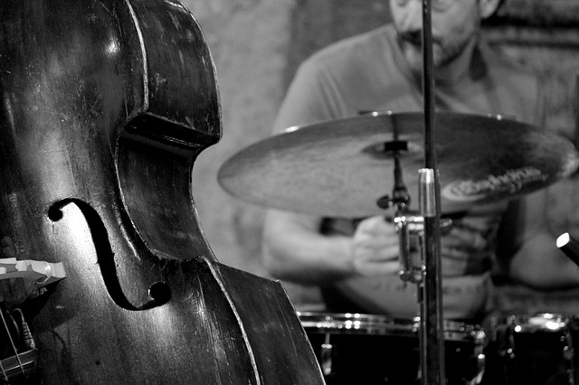
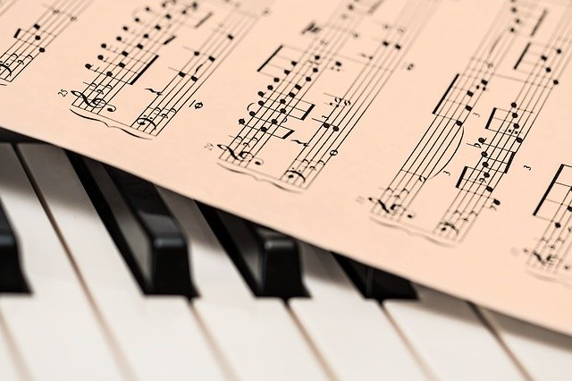
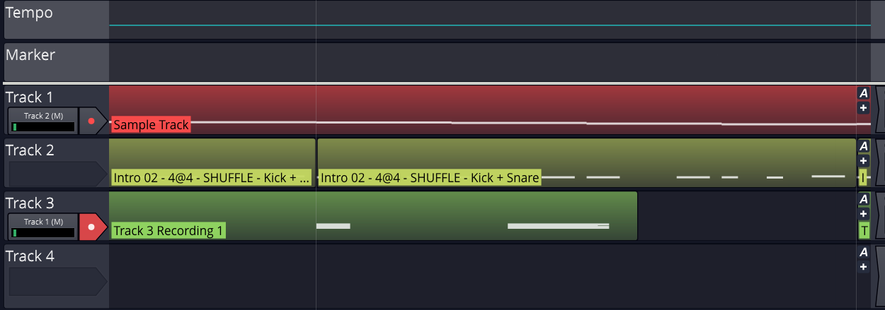

# Walking Bass Generator
by Max Hilsdorf

## Introduction

The *Walking Bass* is one of the key stilistic elements of Jazz.
You will find it, for example, in Frank Sinatras famous interpretation of the jazz standard 
["Fly Me to The Moon](https://www.youtube.com/watch?v=ZEcqHA7dbwM).

Outside of Jazz, the Walking Bass found great usage in the 50's in many Rock'n'Roll songs. 
Even in pop music, every now and then a Walking Bass sneaks into the top charts. Two examples are:
1. [The Beatles - All My Loving (1963)](https://www.youtube.com/watch?v=ZEcqHA7dbwM)
2. [Queen - Crazy Little Thing Called Love (1980)](https://www.youtube.com/watch?v=ZEcqHA7dbwM)

## Music Theory

## Algorithm

## Output

